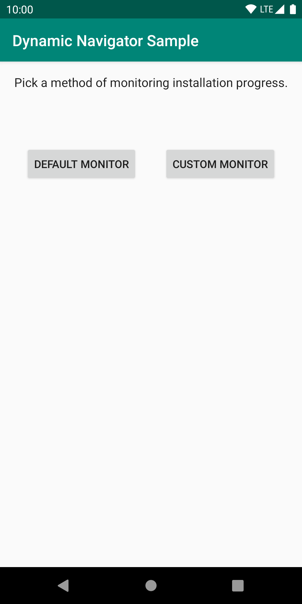
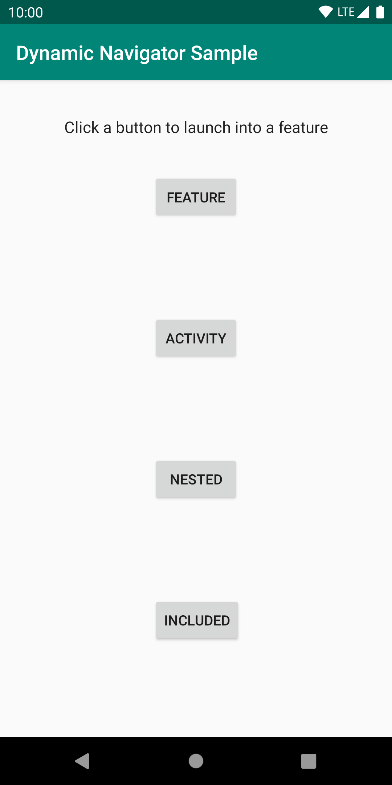

Sample for Dynamic Feature Navigator
==============================================

Learn how to [navigate with dynamic feature modules](https://developer.android.com/guide/navigation/navigation-dynamic).

### Features

This sample showcases the following uses of the Dynamic Feature Navigator:

* Navigating to dynamic feature modules
  * that are not installed
  * within an included graph
* Installing dynamic feature modules before navigating
* Using custom install monitors

### Screenshots




### Usage

To test the sample locally, you can use the following Gradle task:

```
./gradlew installApkSplitsForTestDebug
```

This will use `bundletool` to build an APK set in local testing mode, and install the base app to a 
connected device or emulator, while also pushing all split APKs into the device's storage.

At runtime, based on the local testing meta-data set in the Manifest by `bundletool`, 
`SplitInstallManager` will load dynamic feature modules from local storage instead of connecting to 
the Play Store.

If you wish to test real behavior including downloading modules from the Play Store, you can use 
[internal app sharing](https://support.google.com/googleplay/android-developer/answer/9303479?hl=en).  

License
-------
```
Copyright 2020 The Android Open Source Project, Inc.

Licensed to the Apache Software Foundation (ASF) under one or more contributor
license agreements.  See the NOTICE file distributed with this work for
additional information regarding copyright ownership.  The ASF licenses this
file to you under the Apache License, Version 2.0 (the "License"); you may not
use this file except in compliance with the License.  You may obtain a copy of
the License at

http://www.apache.org/licenses/LICENSE-2.0

Unless required by applicable law or agreed to in writing, software
distributed under the License is distributed on an "AS IS" BASIS, WITHOUT
WARRANTIES OR CONDITIONS OF ANY KIND, either express or implied.  See the
License for the specific language governing permissions and limitations under
the License.
```
